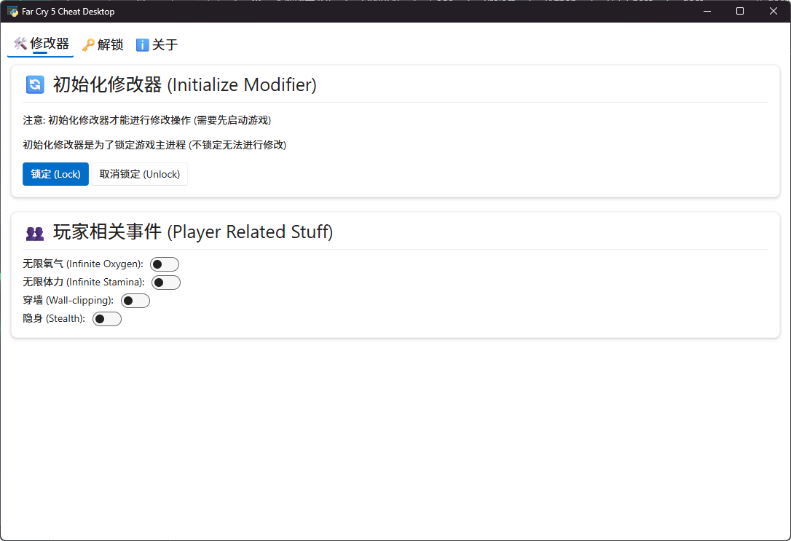

<h1 align="center">FC5Cheat</h1>

    
    
    

基于 Python 开发的《孤岛惊魂5》修改器

## 说明
目前还处于初期阶段, 请等待开发者完善  
仅对 V1.016 版本测试过 (如果你想要适配 V1.011 欢迎你提交PR)

技术栈:
- Python 3.8+

支持平台:
- Windows 10 1809+

开发文档: <a href="./docs/developer.md">developer.md</a>

## 用户界面

## 开源协议
本项目基于 <a href="https://github.com/SLSYSL/FC5Cheat/blob/master/LICENSE">MIT License</a> 许可证发行